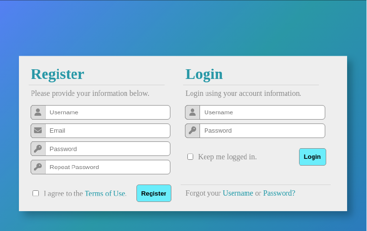

# Form Validation
### Objectives
Create robust form validation using built-in HTML validation attributes and DOM event-driven JavaScript validation.

### General Requirements

To reiterate, these requirements can be completed using any combination of HTML validation attributes and JavaScript event listeners that you want. Consider the right tool for each job before you begin working on it.

### Registration Form Validation Requirements

For the Registration Form section of the page, implement the following validation requirements:

1. **General Requirements:**
   - Whenever any of these validation requirements fail, an appropriate error should be communicated to the user (in most cases, the actual requirement listed below serves as a good error message), and focus should return to the input element that the error originates from.
   - If any requirements fail, the form should not submit.

2. **Registration Form - Username Validation:**
   - The username cannot be blank.
   - The username must be at least four characters long.
   - The username must contain at least two unique characters.
   - The username cannot contain any special characters or whitespace.

3. **Registration Form - Email Validation:**
   - The email must be a valid email address.
   - The email must not be from the domain "example.com."

4. **Registration Form - Password Validation:**
   - Passwords must be at least 12 characters long.
   - Passwords must have at least one uppercase and one lowercase letter.
   - Passwords must contain at least one number.
   - Passwords must contain at least one special character.
   - Passwords cannot contain the word "password" (uppercase, lowercase, or mixed).
   - Passwords cannot contain the username.
   - Both passwords must match.

5. **Registration Form - Terms and Conditions:**
   - The terms and conditions must be accepted.

6. **Registration Form - Form Submission:**
   - Usually, we would send this information to an external API for processing. In our case, we are going to process and store the data locally for practice purposes.

1. **Registration Form - Username Validation (Part Two):**
   - Now that we are storing usernames, create an additional validation rule for them:
     - Usernames must be unique ("that username is already taken" error). Remember that usernames are being stored all lowercase, so "learner" and "Learner" are not unique.

### Login Form Validation Requirements

For the Login Form section of the page, implement the following validation requirements:

1. **Login Form - Username Validation:**
   - The username cannot be blank.
   - The username must exist (within `localStorage`). Remember that usernames are stored in all lowercase, but the username field accepts (and should not invalidate) mixed-case input.

2. **Login Form - Password Validation:**
   - The password cannot be blank.
   - The password must be correct (validate against `localStorage`).

3. **Login Form - Form Submission:**
   - If all validation is successful, clear all form fields and show a success message.
   - If "Keep me logged in" is checked, modify the success message to indicate this (normally, this would be handled by a variety of persistent login tools and technologies).

## Completion

Test your validation thoroughly! Try to break things!

If all validation is successful, store the username, email, and password using `localStorage`. If you are unfamiliar with `localStorage`, that is okay! Reference the documentation's "Description" and "Examples" sections to learn how to implement it. If you run into issues, speak with a peer or one of your instructors.

Consider how you want to store the user data, keeping in mind that there will be quite a few users registering for the site. Perhaps you want to store it with an array of user objects; or maybe an object whose keys are the usernames themselves.

- Valid usernames should be converted to all lowercase before being stored.
- Valid emails should be converted to all lowercase before being stored.
- Clear all form fields after successful submission and show a success message.

